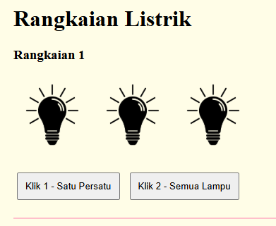
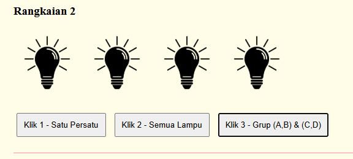

Program menampilkan simulasi lampu yang bisa dinyalakan dan dimatikan menggunakan tombol. Terdapat 2 rangkaian yaitu rangkaian 1 dengan 3 lampu dan rangkaian 2 dengan 4 lampu. Setiap rangkaian memiliki tombol untuk on/off lampu satu persatu dan serentak.

**Penjelasan Kode**

`<title>Rangkaian Listrik Praktikum</title>` Menentukan judul yang muncul di tab browser.

`body { font-family: 'Times New Roman'; padding: 20px; }` Mengatur tampilan halaman menggunakan font Times New Roman dengan jarak 20px dari tepi browser.

`body { background-color: #fffde7; }` Mengatur warna background halaman menjadi kuning pastel.

`.rangkaian { margin-bottom: 30px; border-bottom: 2px solid pink; padding-bottom: 20px; }` Mengatur tampilan setiap div rangkaian, memberi jarak bawah 30px, garis pemisah berwarna pink, dan jarak dalam bawah 20px.

`img { margin: 5px; }` Memberi jarak 5px di setiap sisi gambar lampu agar tidak terlalu rapat.

`button { margin: 5px; padding: 10px; cursor: pointer; }` Mengatur tampilan tombol dengan jarak antar tombol 5px, ukuran tombol 10px, dan kursor berubah menjadi pointer saat diarahkan ke tombol.

`<h1>Rangkaian Listrik</h1>` Menampilkan judul utama halaman.

`
` Membungkus setiap rangkaian dalam sebuah div dengan class rangkaian agar bisa diberi style CSS.

`` Menampilkan gambar lampu dengan kondisi awal mati menggunakan gambar off.png, id l1 digunakan agar bisa diakses dan diubah oleh JavaScript, lebar gambar 100px.

`<button onclick="satuPersatu1()">Klik 1 - Satu Persatu</button>` Membuat tombol yang ketika diklik akan menjalankan fungsi satuPersatu1 untuk menyalakan/mematikan lampu satu persatu.

`<button onclick="semuaLampu1()">Klik 2 - Semua Lampu</button>` Membuat tombol yang ketika diklik akan menjalankan fungsi semuaLampu1 untuk menyalakan/mematikan semua lampu sekaligus.

`<button onclick="grupLampu()">Klik 3 - Grup (A,B) & (C,D)</button>` Membuat tombol khusus rangkaian 2 untuk menyalakan/mematikan lampu per grup AB dan CD secara bergantian.

`let urutan1 = 0;` Menyimpan posisi lampu yang akan dinyalakan/dimatikan selanjutnya pada rangkaian 1, dimulai dari index 0 yaitu lampu pertama.

`const ids1 = ['l1', 'l2', 'l3'];` Menyimpan id semua lampu rangkaian 1 ke dalam array agar bisa diakses menggunakan index.

`if (document.getElementById(ids1[urutan1]).src.includes('off.png'))` Mengecek apakah lampu yang sedang ditunjuk oleh urutan1 dalam kondisi mati dengan melihat apakah src gambarnya mengandung off.png.

`document.getElementById(ids1[urutan1]).src = 'on.png';` Mengganti gambar lampu yang sedang ditunjuk menjadi on.png sehingga lampu terlihat menyala.

`urutan1 = (urutan1 + 1) % 3;` Menggeser urutan ke lampu berikutnya, jika sudah sampai lampu terakhir (index 2) maka akan kembali ke index 0 yaitu lampu pertama.

`let target = document.getElementById('l1').src.includes('off.png') ? 'on.png' : 'off.png';` Mengecek kondisi lampu pertama, jika mati maka variabel target diisi on.png, jika nyala maka diisi off.png.

`ids1.forEach(id => document.getElementById(id).src = target);` Melakukan perulangan untuk mengganti src gambar semua lampu sekaligus sesuai nilai target.

`let urutan2 = 0;` Menyimpan posisi lampu yang akan dinyalakan/dimatikan selanjutnya pada rangkaian 2, sama seperti urutan1 tapi untuk 4 lampu.

`const ids2 = ['lA', 'lB', 'lC', 'lD'];` Menyimpan id semua lampu rangkaian 2 ke dalam array.

`urutan2 = (urutan2 + 1) % 4;` Menggeser urutan ke lampu berikutnya pada rangkaian 2, jika sudah sampai lampu D maka kembali ke lampu A.

`let g = 0;` Menyimpan kondisi grup saat ini, nilai 0 berarti semua mati, 1 berarti AB nyala, 2 berarti CD nyala.

`const ab = ['lA', 'lB'];` Menyimpan id lampu A dan B ke dalam array sebagai grup AB.

`const cd = ['lC', 'lD'];` Menyimpan id lampu C dan D ke dalam array sebagai grup CD.

`ab.forEach(id => document.getElementById(id).src = 'on.png');` Menyalakan semua lampu yang ada di dalam grup AB dengan mengganti src menjadi on.png.

`cd.forEach(id => document.getElementById(id).src = 'off.png');` Mematikan semua lampu yang ada di dalam grup CD dengan mengganti src menjadi off.png.

`g = 1;` Mengubah nilai g menjadi 1 agar klik berikutnya masuk ke kondisi else if yaitu menyalakan grup CD dan mematikan grup AB.

`g = 2;` Mengubah nilai g menjadi 2 agar klik berikutnya masuk ke kondisi else yaitu mematikan semua lampu.

`g = 0;` Mereset nilai g kembali ke 0 agar siklus grup bisa dimulai dari awal lagi.

## SS Output

### Rangkaian Lampu

### Rangkaian Lampu

